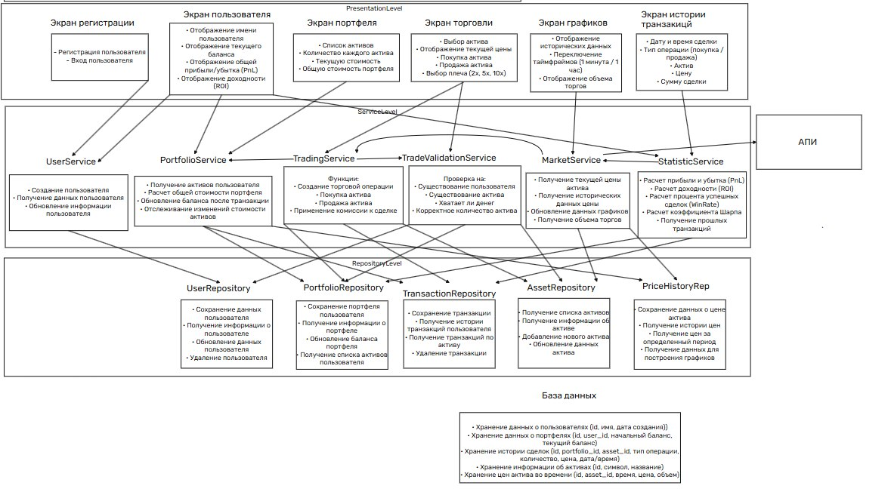
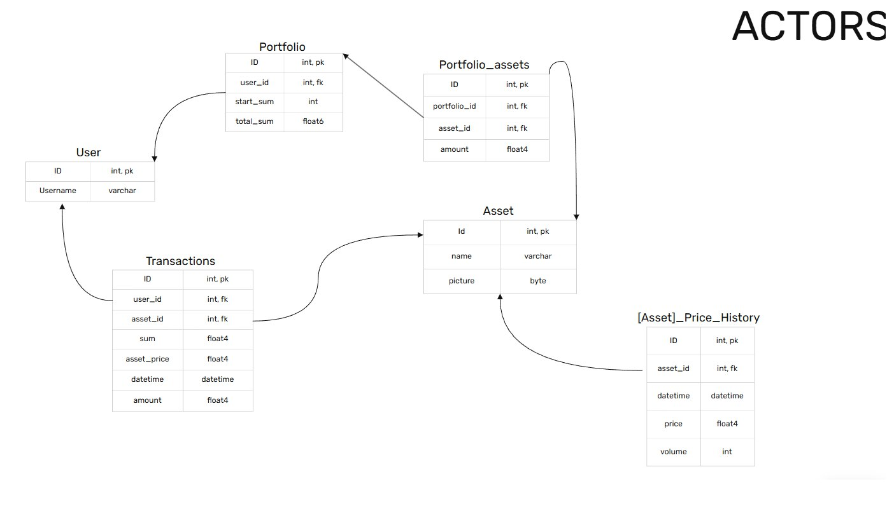

# Спецификация API

## Schemas
<details>
<summary>Схема общения</summary>



</details><details>
<summary>Схема сущностей</summary>



</details>


## Endpoints

### /Assets
- GET = Получить список всех активов
  - ?name с определенным именем
  - ?id с определенным id
  - ?page страница записей в ответе, если не задана, то выводить все
  - ?perPage количество записей в странице. Дефолт = 5.
Если не задана page, но задано это, то возвращать BadRequest
  - RESPONSE_BODY:
  ```json lines
  {
    "assets": [
    {
      "id":  int,
      "name": string,
      "price_history": [
      {
        "time": datetime,
        "price": double,
        "volume": int
      }]
    }]
  }
  ```
- POST = Создать новый актив
  - BODY: 
  ```json lines
  {
    "name": string,
    "picture": byte
  }
  ```

### /Assets/id
- GET = Получить актив по id
  - RESPONSE_BODY:
  ```json lines
  {
    "asset": {
      "id":  int,
      "name": string,
      "price_history": [
      {
        "time": datetime,
        "price": double,
        "volume": int
      }]
    }
  }
  ```
- PUT = Изменить имя или картинку актива
  - BODY: 
  ```json lines
  {
    "name": string,
    "picture": byte
  }
  ```
- DELETE = Удалить актив
  - RESPONSE_BODY:
  ```json lines
  {
    "asset": {
      "id":  int,
      "name": string,
    }
  }
  ```

### /Price_histories
- GET = Получить список всех цен активов
  - ?asset_id с определенным asset_id
  - ?page страница записей в ответе, если не задана, то выводить все
  - ?perPage количество записей в странице. Дефолт = 5.
    Если не задана page, то возвращать BadRequest
  - RESPONSE_BODY:
  ```json lines
  {
    "price_histories": [
    {
      "asset_id": int,
      "time": datetime,
      "price": double,
      "volume": int
    }]
  }
  ```

### /Price_histories/Asset_id
- GET = Получить цены определенного актива
  - RESPONSE_BODY:
  ```json lines
  {
    "price_history": [
    {
      "time": datetime,
      "price": double,
      "volume": int
    }]
  }
  ```
- POST = Добавить запись в цену актива
  - BODY:
  ```json lines
  {
    "price": double,
    "volume": int
  }
  ```

#### /Users
- GET = Получить список всех пользователей
  - ?id с определенным id
  - ?username с определенным username
  - ?page страница записей в ответе, если не задана, то выводить все
  - ?perPage количество записей в странице. Дефолт = 5.
  - RESPONSE_BODY:
  ```json lines
  {
    "users": [
    {
      "id":  int,
      "username": string,
      "portfolio": {
        "user_id":  int,
        "start_sum": int,
        "total_sum": double,
        "portfolio_assets": [
        {
          "asset_id": int,
          "amount": double
        }]
      }
    }]
  }
  ```
- POST = Создать нового пользователя
  - BODY:
  ```json lines
  {
    "username": string
  }
  ```
- DELETE = Удалить пользователей
  - RESPONSE_BODY:
  ```json lines
  {
    "user": {
      "id":  int,
      "username": string,
      "portfolio": {
        "user_id":  int,
        "start_sum": int,
        "total_sum": double,
        "portfolio_assets": [
        {
          "asset_id": int,
          "amount": double
        }]
      }
    }
  }
  ```

#### /Users/id
- GET = Получить пользователя с id = id
- PUT = Изменить имя пользователя с id
  - BODY: 
  ```json lines
  {
    "user": {
      "id":  int,
      "username": string,
      "portfolio": {
        "user_id":  int,
        "start_sum": int,
        "total_sum": double,
        "portfolio_assets": [
        {
          "asset_id": int,
          "amount": double
        }]
      }
    },
  }
  ```
- DELETE = удалить пользователя
  - RESPONSE_BODY:
  ```json lines
  {
    "user": {
      "id":  int,
      "username": string,
      "portfolio": {
        "user_id":  int,
        "start_sum": int,
        "total_sum": double,
        "portfolio_assets": [
        {
          "asset_id": int,
          "amount": double
        }]
      }
    },
  }
  ```

#### /Portfolios
- GET = Получить все портфели
  - ?id с определенным id
  - ?start_sum с определенной суммой старта
  - ?total_sum_less общая сумма меньше чем
  - ?total_sum_more общая сумма больше чем
    - RESPONSE_BODY:
  ```json lines
  {
    "portfolios": [
    {
      "user_id":  int,
      "start_sum": int,
      "total_sum": double,
      "portfolio_assets": [
      {
        "asset_id": int,
        "amount": double
      }]
    }]
  }
  ```
- POST = Создать новый портфель
  - BODY:
  ```json lines
  {
    "user_id":  int,
    "start_sum": int
  }
  ```
- DELETE = Удалить все портфели
  - RESPONSE_BODY:
  ```json lines
  {
    "portfolios": [
    {
      "user_id":  int,
      "start_sum": int,
      "total_sum": double,
      "portfolio_assets": [
      {
        "asset_id": int,
        "amount": double
      }]
    }]
  }
  ```

#### /Portfolios/user_id
- GET = Получить портфель по id пользователя
  - RESPONSE_BODY:
  ```json lines
  {
    "user_id":  int,
    "start_sum": int,
    "total_sum": double,
    "portfolio_assets": [
    {
      "asset_id": int,
      "amount": double
    }]
  }
  ```
- PUT = Изменить сумму портфеля пользователя
  - BODY:
  ```json lines
  {
    "total_sum": double
  }
  ```
- DELETE = Удалить портфель
  - RESPONSE_BODY:
  ```json lines
  {
    "user_id":  int,
    "start_sum": int,
    "total_sum": double
  }
  ```
  
#### /Portfolio_assets/Portfolio_id
- GET = Получить активы портфеля по id
  - RESPONSE_BODY:
    ```json lines
    {
      "portfolio_assets": [
      {
        "asset_id": int,
        "amount": double
      }]
    }
    ```
- PUT = Добавить актив в активы портфеля
  - BODY:
  ```json lines
  {
    "asset_id": int,
    "amount": int
  }
  ```
  
#### /Transactions
- GET = Получить все транзакции
  - ?id с определенным id
  - ?asset_id с определенным id актива
  - ?sum_less сумма меньше чем
  - ?sum_more сумма больше чем
    - RESPONSE_BODY:
  ```json lines
  {
    "transactions": [
    {
      "user_id":  int,
      "asset_id": int,
      "sum": double,
      "asset_price": double,
      "datetime": datetime,
      "amount": double
    }]
  }
  ```
- POST = Создать новую транзакцию
  - BODY:
  ```json lines
  {
    "transaction": {
      "user_id":  int,
      "asset_id": int,
      "sum": double,
      "asset_price": double,
      "amount": double,
    }
  }
  ```